# Guide d'utilisation de TimeToWork

TimeToWork est une application de suivi du temps dans l'esprit de Clockify : on note ce sur quoi on travaille (avec un minuteur ou en saisissant des horaires), on range le temps par projet et par client, puis on l'analyse dans un calendrier, un tableau de bord et des rapports exportables.

> Les captures d'écran de ce guide montrent un compte de démonstration (« Camille Martin ») avec des données fictives. Elles sont générées automatiquement, voir [Régénérer les captures](#régénérer-les-captures).

## Sommaire

1. [Démarrer](#1-démarrer)
2. [Compte et connexion](#2-compte-et-connexion)
3. [Suivi du temps](#3-suivi-du-temps)
4. [Calendrier](#4-calendrier)
5. [Tableau de bord](#5-tableau-de-bord)
6. [Rapports et exports](#6-rapports-et-exports)
7. [Projets et clients](#7-projets-et-clients)
8. [Administration](#8-administration)
9. [Bonnes pratiques et sécurité](#9-bonnes-pratiques-et-sécurité)
10. [Dépannage](#10-dépannage)

---

## 1. Démarrer

Il faut [Docker](https://www.docker.com/) (avec Docker Compose). Depuis le dossier du projet :

```bash
cp .env.example .env
docker compose up --build
```

| Adresse | Contenu |
|---|---|
| http://localhost:8080 | L'application (à ouvrir dans le navigateur) |
| http://localhost:4000/api | L'API |
| localhost:5432 | La base PostgreSQL |

Ces trois ports ne sont ouverts **que sur votre machine** : personne d'autre sur le réseau ne peut s'y connecter.

Avant un vrai usage, ouvrez le fichier `.env` et remplacez `JWT_SECRET` par un secret aléatoire (voir [section 9](#9-bonnes-pratiques-et-sécurité)). Les autres réglages utiles :

| Variable | Rôle |
|---|---|
| `JWT_SECRET` | Signe les sessions. **À remplacer** par `openssl rand -hex 32`. |
| `DEV_MODE` | `true` = connexion rapide sans mot de passe (développement local uniquement). |
| `SMTP_HOST`, `SMTP_USER`… | Envoi des emails de réinitialisation de mot de passe (facultatif). |
| `POSTGRES_PASSWORD` | Mot de passe de la base. |

---

## 2. Compte et connexion

### Créer un compte

Sur `/register`, saisissez un nom, un email et un mot de passe de **8 à 72 caractères**. Vous êtes connecté immédiatement.

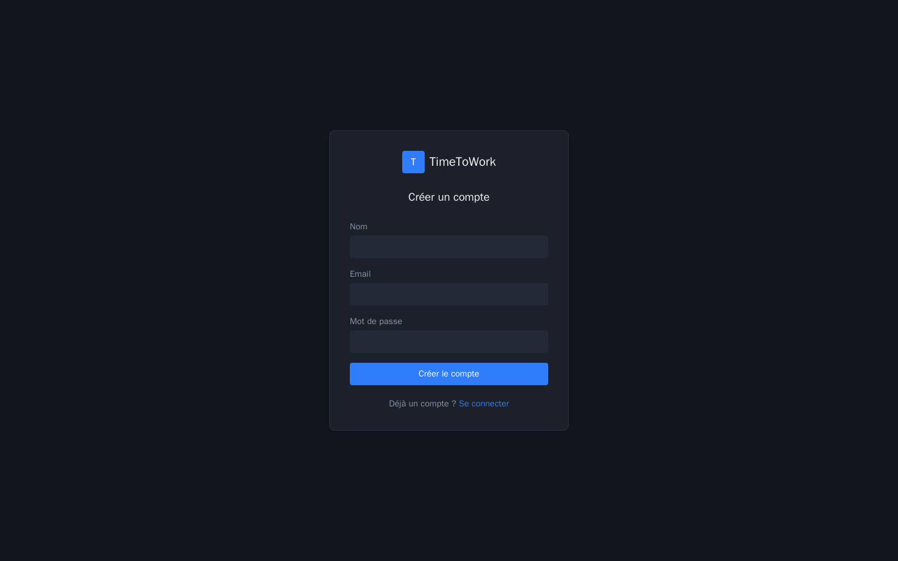

### Se connecter

Saisissez votre email et votre mot de passe. Après 10 mots de passe faux pour un même compte, la connexion est bloquée quelques minutes (« Trop de tentatives »).


> **Mode développeur.** Si `DEV_MODE=true`, la page de connexion affiche en plus la liste de tous les comptes : un clic sur un compte connecte sans mot de passe. Réservé à un usage strictement local.

### Mot de passe oublié

Cliquez sur « Mot de passe oublié ? », saisissez votre email : un lien de réinitialisation valable **1 heure** et utilisable **une seule fois** vous est envoyé. Le message affiché est toujours le même, que le compte existe ou non.

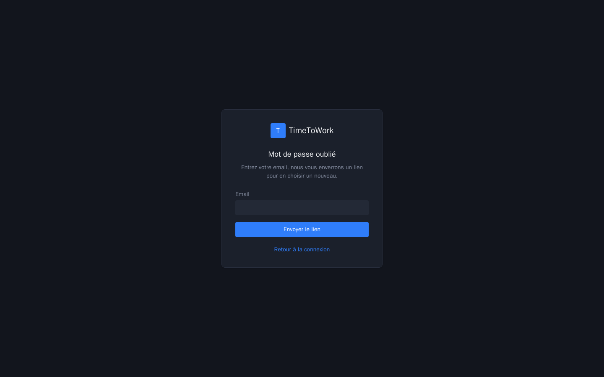

Si aucun serveur email n'est configuré (`SMTP_HOST` vide), aucun email ne part : le lien apparaît dans les logs du backend.

```bash
docker compose logs backend
```

### Mon compte : changer son mot de passe

Le lien « Mon compte » du menu affiche votre nom et votre email, et permet de changer de mot de passe : saisissez l'actuel, puis le nouveau (8 caractères minimum, différent de l'actuel) deux fois.

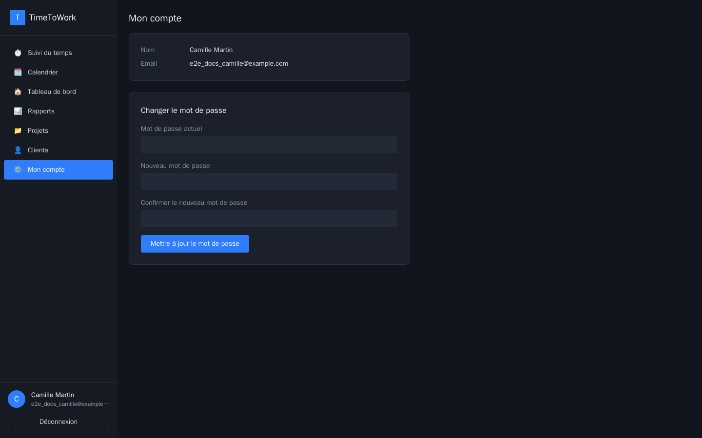

---

## 3. Suivi du temps

C'est la page d'accueil. En haut, la barre de saisie ; dessous, votre historique rangé par semaine, puis par jour.

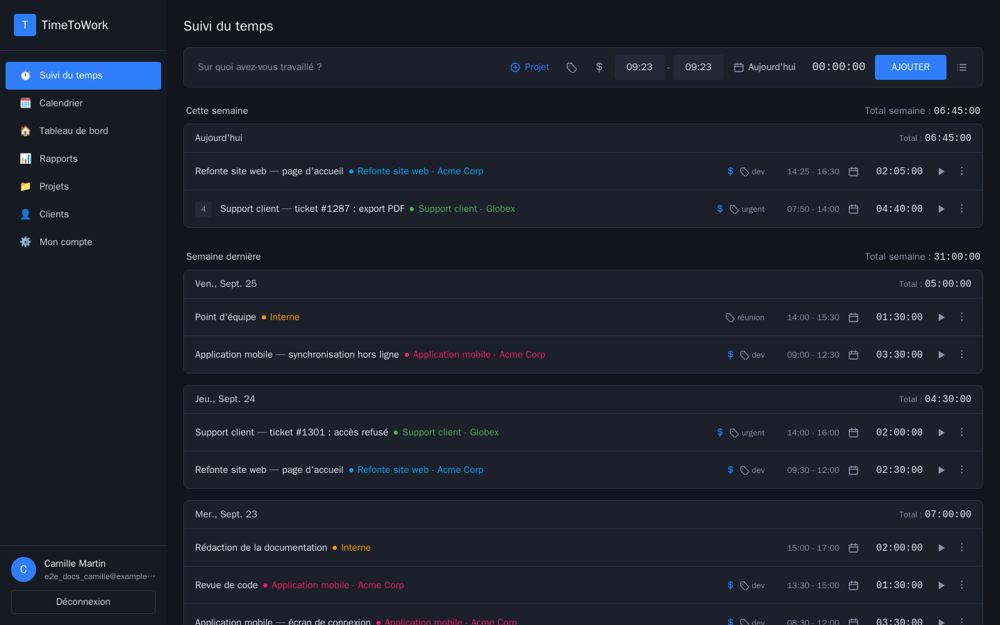

### La barre de saisie

De gauche à droite : la description, le **projet**, les **balises** (tags), le bouton **$** (facturable), puis les horaires. Le bouton tout à droite (icône liste ou chronomètre) bascule entre les deux modes.

**Mode saisie manuelle** (par défaut) — pour noter du temps déjà passé :

- **Début** et **fin** se tapent librement : `0800`, `8h30`, `8:00` ou `8` sont tous compris et remis au format `08:00`.
- Le bouton calendrier change la **date** (aujourd'hui par défaut).
- Le champ **durée** se tape aussi (`1:30` ou `90` pour 90 minutes) : c'est la fin qui se déplace, le début reste.
- **AJOUTER** enregistre l'entrée.

**Tâches récentes.** Un clic dans la description propose vos 5 dernières tâches ; en choisir une reprend sa description et son projet.

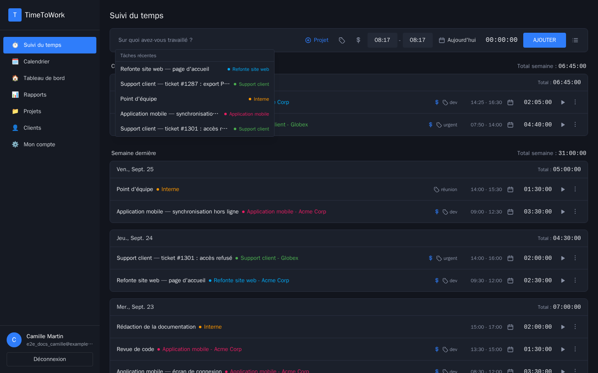

**Projet et balises.** Le bouton « Projet » liste vos projets (avec leur client). Les balises se cherchent ou se créent à la volée (Entrée).

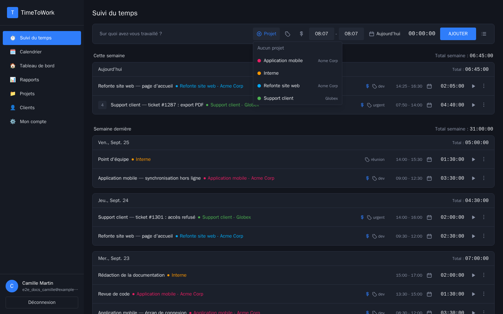

### Le minuteur

Basculez en mode minuteur, décrivez la tâche, choisissez le projet, puis **DÉMARRER**. Le compteur tourne ; **ARRÊTER** enregistre l'entrée.

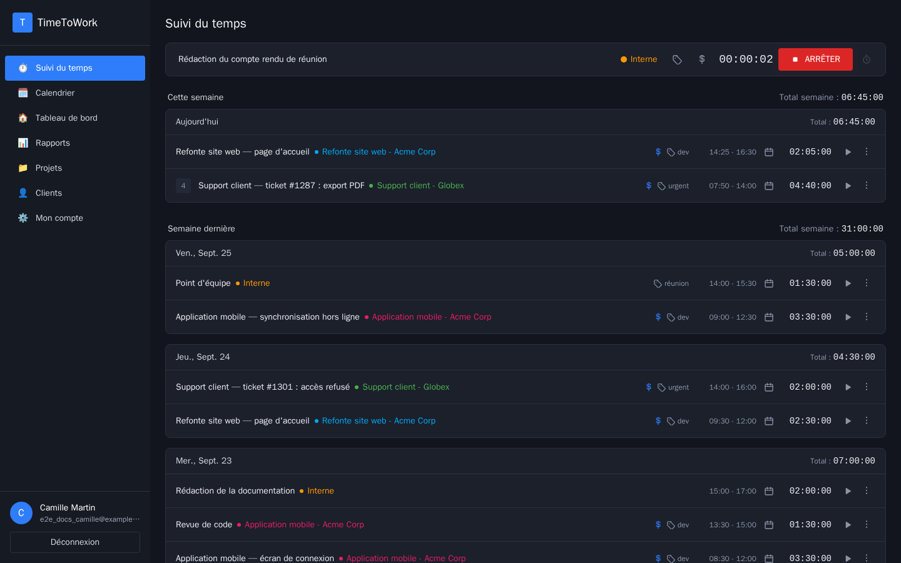

- Un seul minuteur à la fois : en démarrer un autre arrête le précédent.
- Le minuteur survit à un rechargement de la page ; le bouton de changement de mode est verrouillé pendant qu'il tourne.

### L'historique

Chaque ligne affiche la description, le projet et son client, le signe **$** si facturable, les balises, les horaires et la durée. À droite, **▶ Continuer** relance un minuteur identique (même description, projet, balises), et le menu **⋮** permet de supprimer.

Les entrées identiques d'une même journée (même description, projet, balises et facturable) sont regroupées sur une ligne avec un compteur (ici « 4 ») ; un clic la déplie.

### Modifier une entrée

Cliquez sur une ligne pour ouvrir l'éditeur : description, projet, balises, facturable, heures, date et durée se modifient directement, chaque changement est enregistré à l'instant.

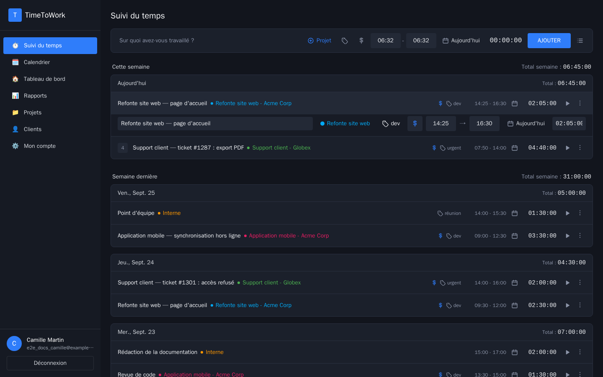

### Fusionner des créneaux

Une même mission est parfois coupée en plusieurs morceaux (8:45–10:00 puis 10:00–12:00). Dépliez le groupe, ouvrez le menu **⋮** d'une ligne et choisissez **Fusionner avec le créneau précédent** (ou **suivant**).

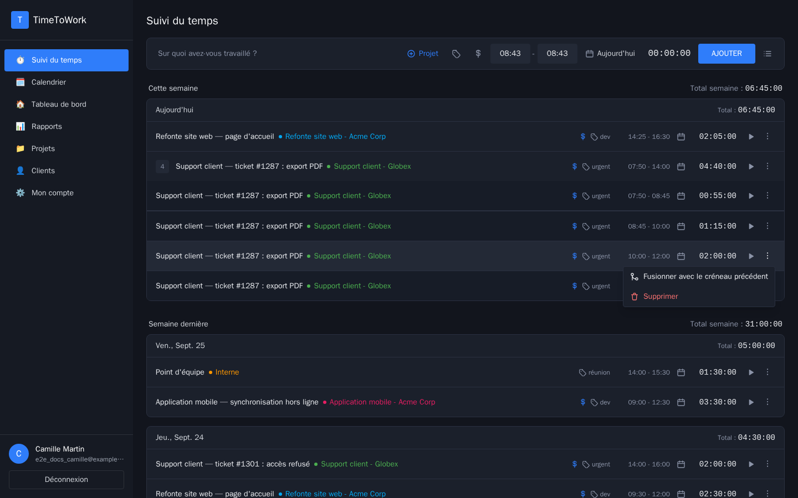

- Le menu ⋮ de la **ligne du groupe** propose « Fusionner les créneaux consécutifs » : toutes les suites sans pause sont fusionnées d'un coup.
- Ne sont fusionnables que des créneaux **de la même mission** (mêmes description, projet, balises, facturable) **sans pause** (1 minute au plus). Une pause déjeuner ou une autre mission ne se fusionne jamais : le temps total ne change donc jamais.

---

## 4. Calendrier

Vos entrées dessinées sur une grille horaire : chacune est placée à son **heure réelle** et sa hauteur est proportionnelle à sa **durée**.

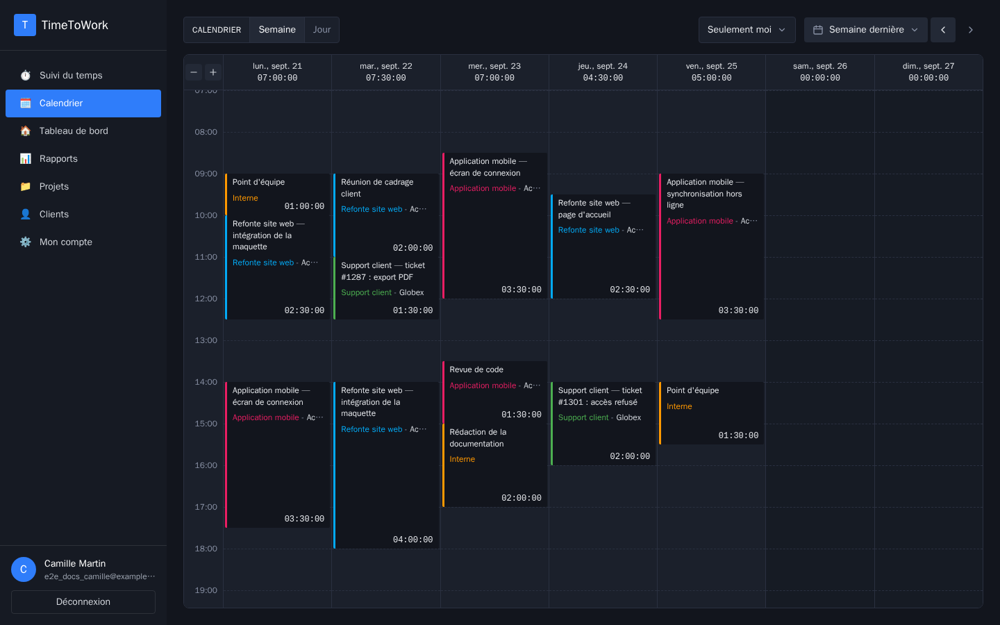

- **Semaine / Jour** : le bouton en haut à gauche change de vue ; les flèches ‹ › avancent d'une semaine ou d'un jour.
- **− / +** (en haut à gauche de la grille) zooment de 30 à 120 pixels par heure.
- Chaque colonne indique son **total** ; les week-ends sont plus sombres ; une ligne rouge marque l'heure actuelle sur la journée du jour.
- Deux entrées qui se chevauchent sont placées côte à côte.

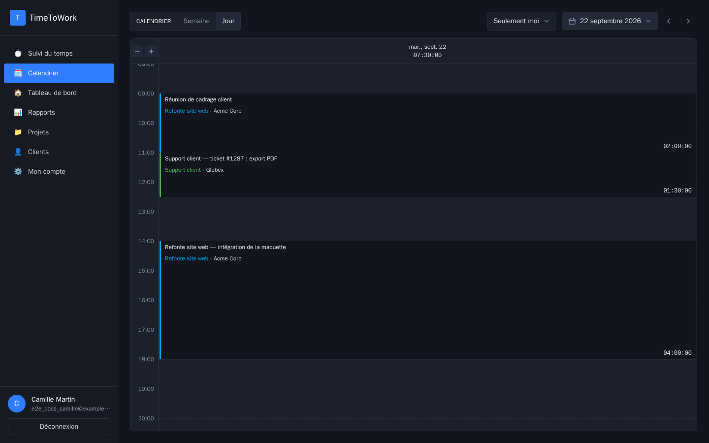

### Modifier un créneau

Un clic sur un bloc ouvre **Modifier le créneau** : durée, début, fin, date, description, projet et balises. Le menu **⋮** en bas à gauche supprime l'entrée ; **Annuler**, la croix ou la touche Échap ferment sans rien enregistrer.

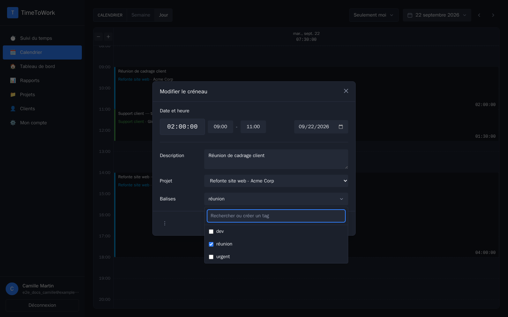

- La fin doit être après le début (sinon **Enregistrer** est grisé).
- Le menu des balises se superpose au dialogue ; Échap le referme sans fermer le dialogue.
- Un créneau **en cours** (minuteur actif) n'a que son heure de début modifiable.

---

## 5. Tableau de bord

La synthèse d'une période (cette semaine par défaut ; ici « Semaine dernière »).

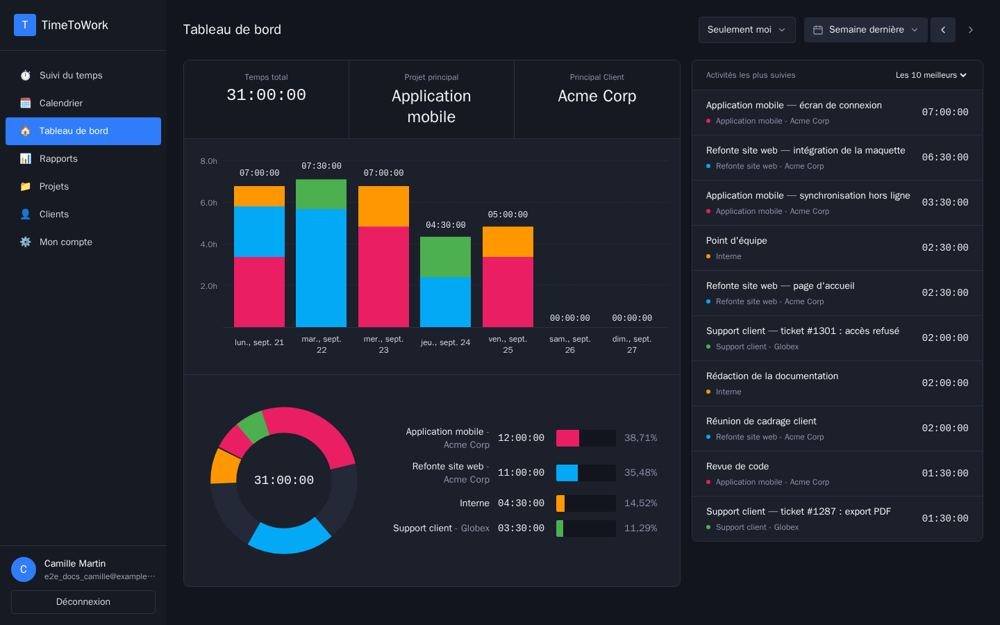

- **Bandeau du haut** : temps total, projet principal et client principal de la période.
- **Histogramme** : une barre par jour, empilée par projet, avec la durée au-dessus. Sur une période longue (plus de 62 jours), une barre par mois.
- **Donut et liste** : la répartition du temps par projet, avec les pourcentages.
- **Activités les plus suivies** (à droite) : les entrées de même description et même projet sont additionnées puis classées. Le menu permet d'afficher les 5, 10 ou 20 meilleures.
- Le sélecteur de période propose les périodes usuelles et une **plage personnalisée**.

---

## 6. Rapports et exports

Le menu **Rapports** a quatre onglets (le quatrième, « Partagé », n'est pas encore disponible). Tous partagent la période, les filtres et l'interrupteur **Arrondi** (durées arrondies au quart d'heure).

### Résumé

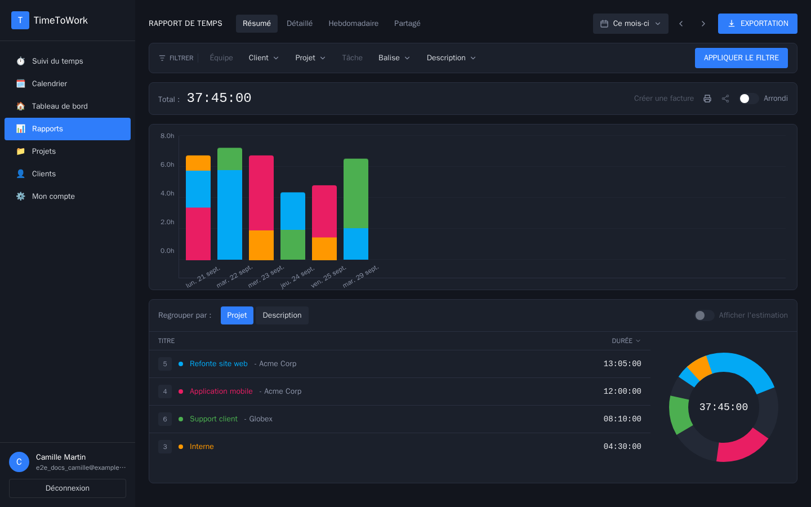

Un histogramme par jour, puis la liste des projets avec leur durée et leur nombre d'entrées. Un clic sur une ligne détaille ses entrées. Le bouton **Regrouper par** bascule entre **Projet** et **Description**.

### Choisir la période

Le sélecteur propose Aujourd'hui, Hier, Cette semaine, Semaine dernière, Ce mois-ci, Mois dernier, Cette année, et **Plage personnalisée…** pour deux dates au choix. Les flèches ‹ › décalent la période.

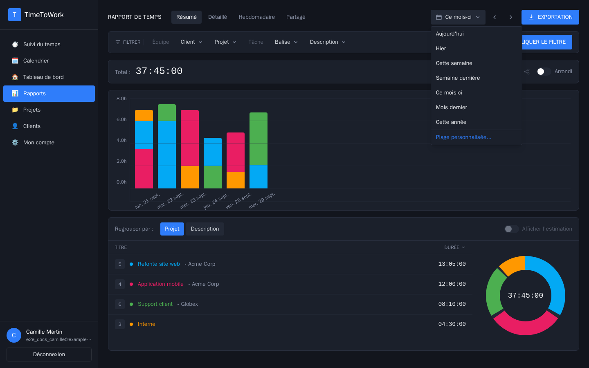

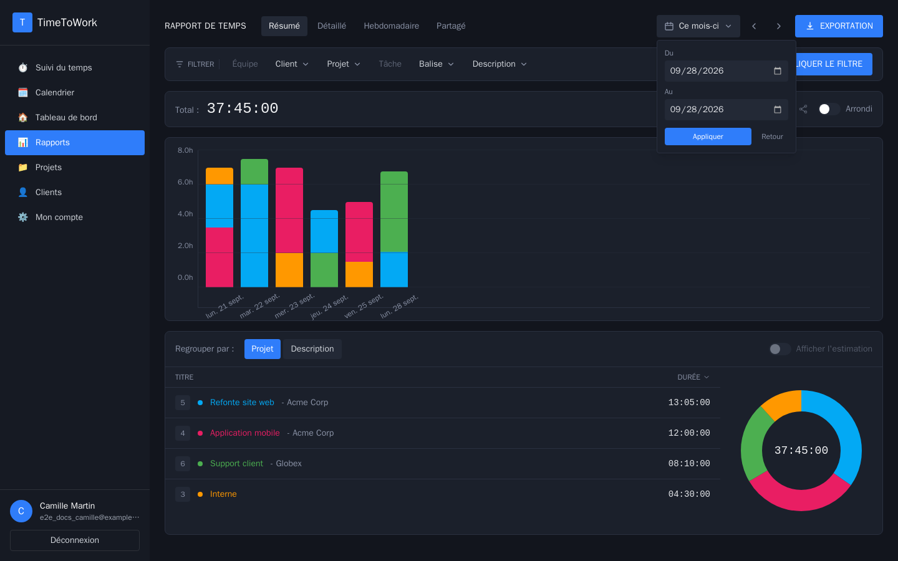

### Filtres

**Client**, **Projet**, **Balise** (choix multiples) et **Description** (texte contenu) restreignent tout le rapport, le total et l'export compris. Les filtres s'appliquent dès qu'on les change.

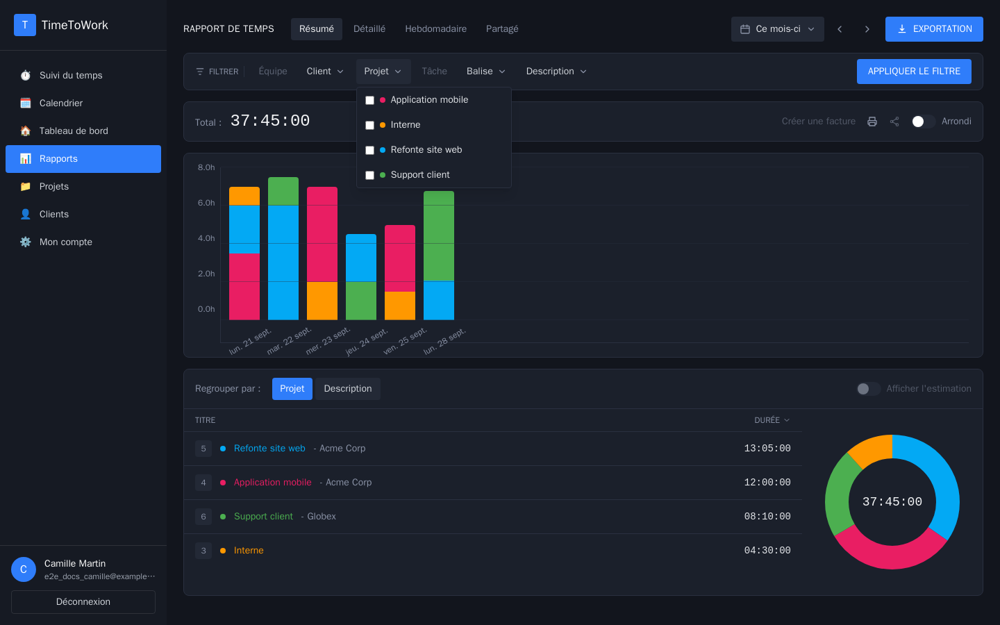

### Détaillé

Une ligne par entrée, de la plus récente à la plus ancienne. Cochez des lignes pour les **supprimer en masse**, ajoutez des balises directement, ou utilisez le menu ⋮ (continuer, supprimer).

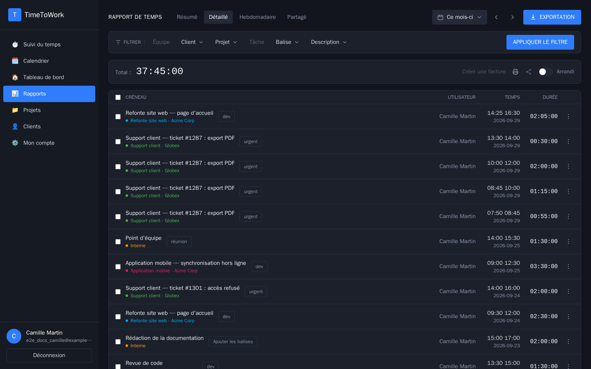

### Hebdomadaire

Exactement **une semaine** (du lundi au dimanche) : une ligne par projet, client ou description (au choix, via « Regrouper par »), une colonne par jour, et les totaux par ligne et par jour. Les flèches changent de semaine.

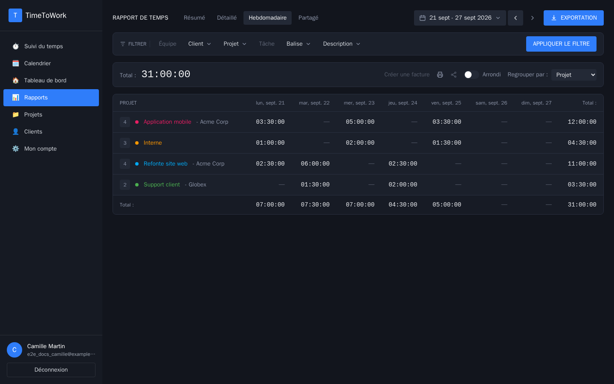

### Exporter

Le bouton **EXPORTATION** ouvre la fenêtre d'export.

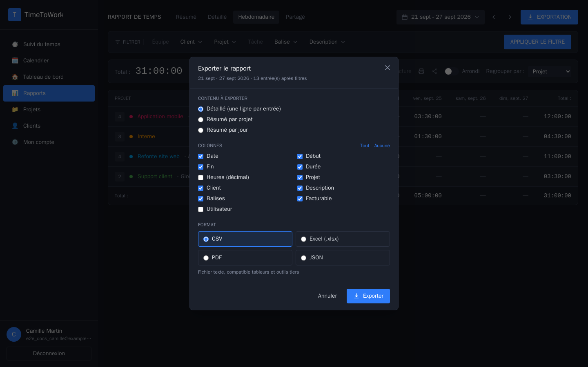

1. **Contenu** : *Détaillé* (une ligne par entrée), *Résumé par projet* ou *Résumé par jour*.
2. **Colonnes** (pour le détaillé) : date, début, fin, durée, heures décimales, projet, client, description, balises, facturable, utilisateur. **Tout** / **Aucune** en un clic.
3. **Format** : **CSV**, **Excel (.xlsx)**, **PDF** (ouvre l'impression du navigateur : choisissez « Enregistrer au format PDF ») ou **JSON**.

Le fichier reprend la période et les filtres affichés, et s'appelle par exemple `rapport-detaille_2026-09-01_2026-09-30.csv`. Les cellules CSV commençant par `=`, `+`, `-` ou `@` sont neutralisées pour qu'Excel ne les exécute pas comme des formules.

---

## 7. Projets et clients

### Projets

Un projet a un **nom**, une **couleur** et, si vous le souhaitez, un **client**. La couleur se retrouve partout : calendrier, graphiques, listes.

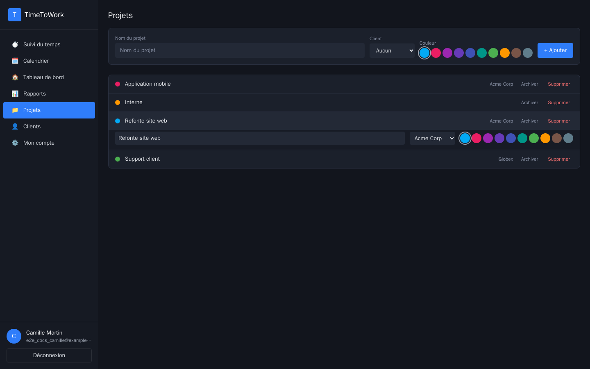

- **Créer** : nom, client, couleur, **+ Ajouter**.
- **Modifier** : cliquez sur la ligne pour ouvrir l'éditeur (nom, client, couleur ; chaque changement est enregistré).
- **Archiver / Réactiver** : le projet reste visible mais barré.
- **Supprimer** : les entrées déjà saisies sont conservées, simplement sans projet.

### Clients

Même principe : on crée, renomme, archive ou supprime un client. Supprimer un client ne supprime pas ses projets ; ils n'ont simplement plus de client.

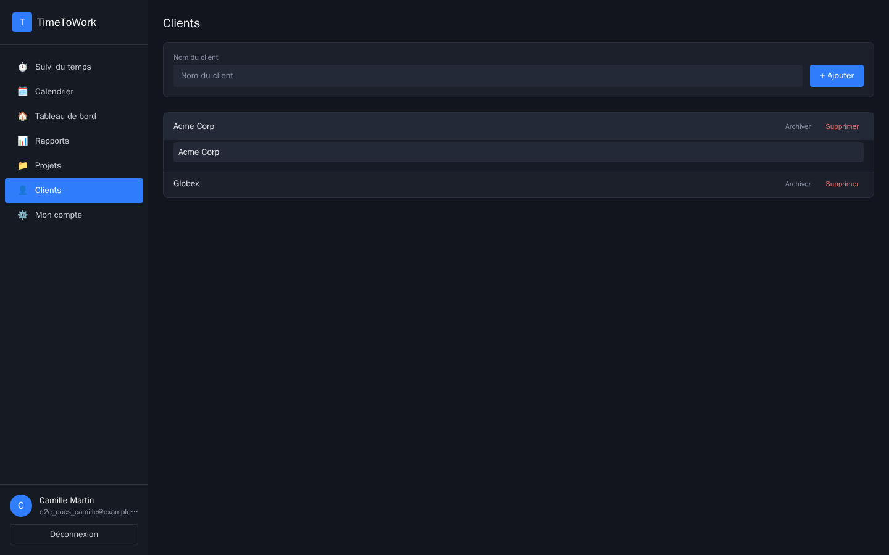

---

## 8. Administration

Un compte peut avoir le rôle **administrateur**. Le lien **Administration** (icône 🛡) apparaît alors en bas du menu ; les autres utilisateurs ne le voient pas, et le serveur refuse leurs appels.

### Créer le premier administrateur

Personne n'est administrateur au départ, et l'application ne permet volontairement pas de se promouvoir soi-même. Le premier se crée en ligne de commande, avec l'email d'un compte existant :

```bash
docker run --rm --network timetowork_default \
  -e DATABASE_URL="postgresql://timetowork:timetowork@db:5432/timetowork" \
  -v "$(pwd)/backend:/app" -w /app node:20-alpine \
  sh -c "apk add --no-cache openssl >/dev/null && npx tsx scripts/set-admin.ts vous@example.com"
```

Ajoutez `--revoke` après l'email pour retirer le rôle. Ensuite, les administrateurs se gèrent depuis la page.

### Onglet Utilisateurs

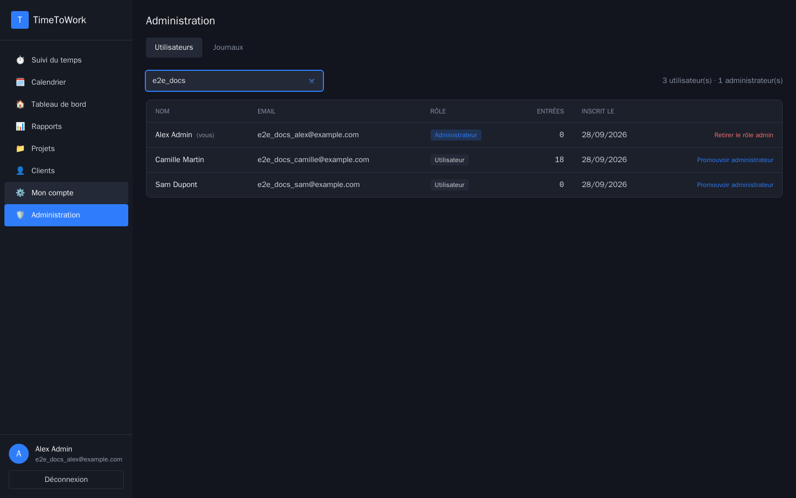

La liste de tous les comptes, avec leur rôle, leur nombre d'entrées et leur date d'inscription ; la recherche filtre par nom ou email. À droite de chaque ligne, un bouton donne ou retire le rôle, **après confirmation** :

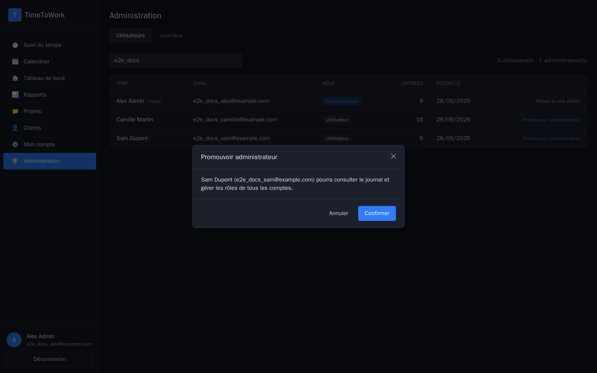

- Le **dernier administrateur ne peut pas être rétrogradé** : l'application ne se retrouve jamais sans personne pour gérer les rôles.
- Un administrateur peut se retirer son propre rôle tant qu'un autre existe ; il perd alors l'accès à la page immédiatement.
- Retirer le rôle prend effet **tout de suite**, même pour quelqu'un déjà connecté.

### Onglet Journaux

Le journal de l'application : ce qui s'est mal passé, et qui a fait quoi.

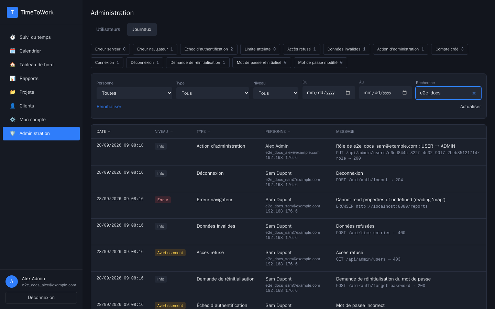

Ce qui est enregistré, par **type** :

| Type | Quand |
|---|---|
| Erreur serveur | Une erreur inattendue dans l'API, avec sa trace |
| Erreur navigateur | Une erreur JavaScript survenue sur l'écran d'un utilisateur, remontée automatiquement |
| Échec d'authentification | Mauvais mot de passe, lien de réinitialisation invalide |
| Limite atteinte | Trop de tentatives (blocage temporaire) |
| Accès refusé | Un utilisateur a tenté une action réservée aux administrateurs |
| Données invalides | L'API a refusé des données (on garde le champ concerné, jamais la valeur) |
| Action d'administration | Un changement de rôle : qui l'a fait et pour qui |

Chaque ligne a aussi un **niveau** : Erreur, Avertissement ou Info.

**Trouver ce qu'on cherche**

- **Compteurs** en haut : le nombre d'entrées de chaque type ; un clic filtre sur ce type (un second clic retire le filtre).
- **Filtres** : par **personne**, par **type**, par **niveau**, par **période** (Du / Au) et par **texte** (message, route, email, détails). Ils se combinent ; « Réinitialiser » les efface.
- **Tri** : cliquez sur l'en-tête **Date**, **Niveau**, **Type** ou **Personne** pour trier ; un second clic inverse l'ordre.
- **Pagination** : 25, 50 ou 100 lignes par page. **Actualiser** recharge.

Un clic sur une ligne affiche ses **détails**, par exemple la trace d'une erreur :

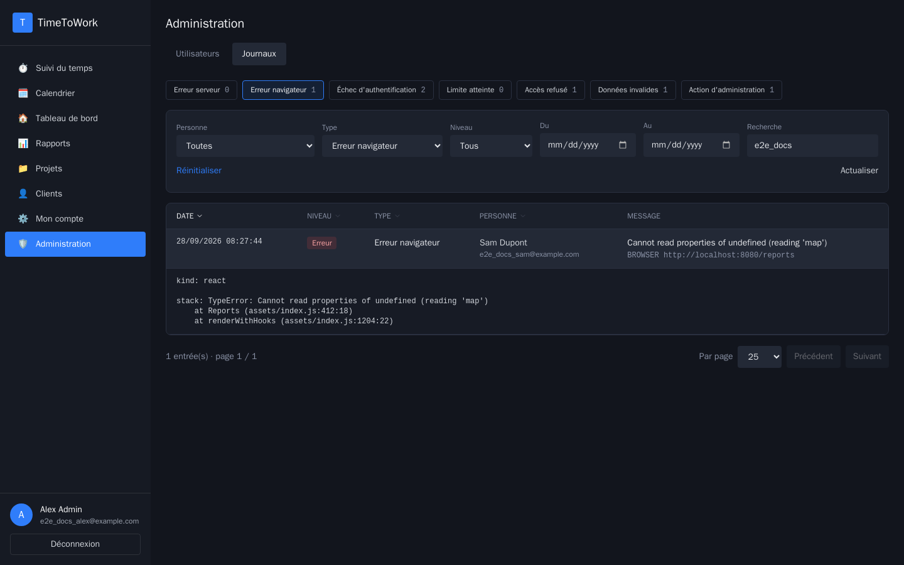

**À savoir**

- Le journal ne contient **jamais** de mot de passe, de jeton ni le contenu des requêtes.
- Les entrées de plus de **30 jours** sont supprimées automatiquement (`LOG_RETENTION_DAYS` pour changer la durée).
- Si un compte est supprimé, ses lignes restent, identifiées par son email.

---

## 9. Bonnes pratiques et sécurité

- **Changez `JWT_SECRET`.** C'est le secret qui signe les sessions : avec la valeur d'exemple, n'importe qui connaissant le projet peut fabriquer une session valide. Générez-en un :

  ```bash
  openssl rand -hex 32
  ```

  Collez le résultat dans `.env` puis relancez le backend (`docker compose up -d backend`). Tout le monde est déconnecté une fois. Avec `DEV_MODE=false`, le serveur refuse même de démarrer sur un secret faible.
- **`DEV_MODE=true` uniquement en local.** Cette option permet de se connecter à n'importe quel compte sans mot de passe.
- **Ne publiez pas les ports** de la base et de l'API sur Internet : le fichier `docker-compose.yml` les limite volontairement à `127.0.0.1`.
- **Sauvegardez la base** régulièrement :

  ```bash
  docker compose exec db pg_dump -U timetowork timetowork > sauvegarde.sql
  ```
- **Mots de passe** : 8 à 72 caractères. Les sessions durent 30 jours ; se déconnecter n'invalide pas un jeton volé, changez de `JWT_SECRET` en cas de doute.

Détail des protections en place (isolation des données, limitation des tentatives, en-têtes, etc.) : section « Sécurité » du [README](../README.md).

---

## 10. Dépannage

| Problème | Solution |
|---|---|
| **Je suis déconnecté après un redémarrage** | Le `JWT_SECRET` a changé : reconnectez-vous. |
| **Je ne vois pas « Administration »** | Votre compte n'est pas administrateur (voir [section 8](#créer-le-premier-administrateur)), ou l'application n'est pas à jour : `docker compose build frontend && docker compose up -d frontend`, puis `Ctrl+F5`. |
| **« Trop de tentatives »** | Trop de mots de passe faux ou de demandes de réinitialisation : attendez 15 minutes (1 heure pour les emails de réinitialisation). |
| **Je ne reçois pas l'email de réinitialisation** | Vérifiez la configuration `SMTP_*` du `.env`. Sans SMTP, le lien est dans `docker compose logs backend`. |
| **Impossible d'ouvrir http://localhost:8080** | Vérifiez que les conteneurs tournent (`docker compose ps`). Les ports ne sont accessibles que depuis votre machine. |
| **Une page affiche « Une erreur est survenue »** | L'incident est signalé dans le journal (type « Erreur navigateur ») ; rechargez la page. |

### Lancer les tests

```bash
# Backend (base de test dédiée)
docker compose -f docker-compose.yml -f docker-compose.test.yml run --rm backend-test

# Bout en bout (un vrai navigateur)
docker compose -f docker-compose.yml -f docker-compose.test.yml build frontend-test
docker compose -f docker-compose.yml -f docker-compose.test.yml up -d frontend-test
docker compose -f docker-compose.yml -f docker-compose.test.yml run --rm e2e
```

### Régénérer les captures

Les images de ce guide sont produites par un script qui crée des comptes de démonstration (préfixe `e2e_docs_`, supprimés par le script de nettoyage des tests) et parcourt chaque écran. À relancer quand l'interface change :

```bash
docker compose -f docker-compose.yml -f docker-compose.test.yml build frontend-test
docker compose -f docker-compose.yml -f docker-compose.test.yml up -d frontend-test
docker compose -f docker-compose.yml -f docker-compose.test.yml run --rm e2e \
  sh -c "npm install && npm run docs:screenshots"
```

Les images sont écrites dans `docs/screenshots/`.
